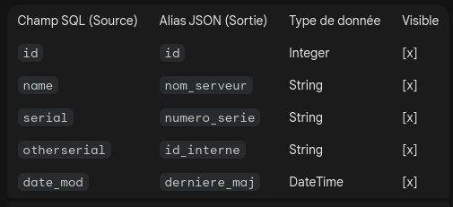

## config dynamique
### BUT

### FONCTIONNALITE
* reseau (url, ip,port??)
* session-token

### COMMENT

### A faire
* se documenter sur le deploiement de glpi (reseau)
## api

### BUT
* facilitation de personnalisation de GLPI
* facilitation de modification de GLPI
    * creation d'api Rest dynamiquement par affichage
    * creation table
    * modification de table ??
    * modification de formulaire??

### FONCTIONNALITE
* creer un api Rest dynamiquement par affichage

### COMMENT

### A implementer (a l' instant t)
* 1. Le Tableau de Bord (Liste des APIs)
* 2. Le "Builder" d'API (L'écran de création)

    * A. Configuration Générale
        * Champ texte : Nom de l'API (slug utilisé dans l'URL).
        * Menu déroulant : Choix de la table principale (ex:glpi_computers, glpi_software, etc.).
        * Checkbox : Activer/Désactiver l'API.
        * methode: CRUD, post, get, put, delete

    * B. Mapping des champs
    Au lieu d'écrire du SQL, l'utilisateur voit un tableau de correspondance :

    Champ SQL (Source),Alias JSON (Sortie),Type de donnée,Visible
    id,id,Integer,[x]
    name,nom_serveur,String,[x]
    serial,numero_serie,String,[x]
    otherserial,id_interne,String,[x]
    date_mod,derniere_maj,DateTime,[x]
    
    

    * C. Constructeur de Filtres (Visual Query Builder)
On ajoute une section pour définir les conditions par défaut (ex: ne lister que les ordinateurs dont le statut est "En stock").

    SI [Champ: Statut] [EGAL A] [Valeur: 2]

* 3. L'Interface de Test Intégrée

Pour faciliter la vie des développeurs, une zone de "Preview" en bas de page permet de tester l'API instantanément sans sortir de GLPI.

// Aperçu du résultat (JSON)
{
  "status": "success",
  "data": [
    {
      "nom_serveur": "SRV-WEB-01",
      "id_interne": "ABC-123",
      "derniere_maj": "2023-10-27 10:00"
    }
  ]
}

